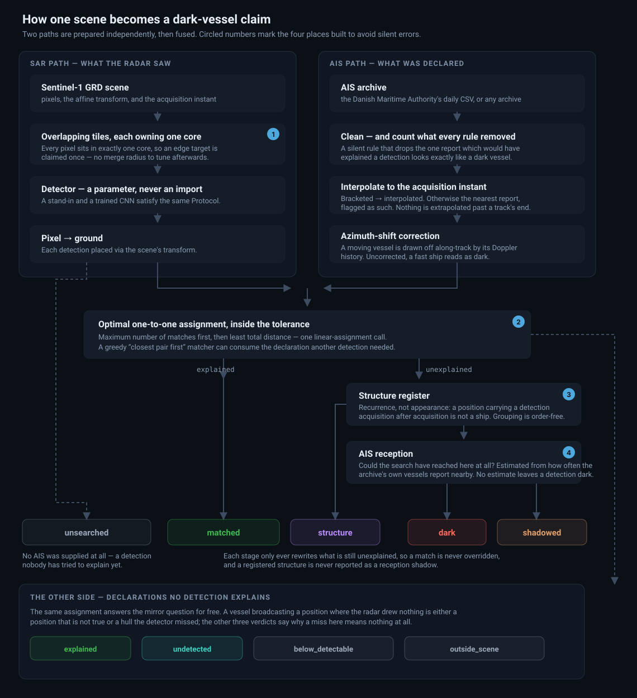

# darkvessel

Detecting undeclared vessels by fusing Sentinel-1 SAR with AIS.

Built to avoid two silent errors that a straightforward implementation makes: greedy
matching that reports explainable vessels as dark, and structure clustering whose answer
depends on row order (see [Two errors this design avoids](#two-errors-this-design-avoids)).

## The problem

Ships are legally required to broadcast their position over AIS. Some do not: the
transponder is off, spoofed, or absent. These are *dark vessels*, and they matter — illegal
fishing, sanctions evasion, unreported transfers at sea.

Radar sees them anyway. Sentinel-1 acquires C-band SAR through cloud and darkness, and a
metal hull is a strong scatterer against near-black water. Detect every vessel in the radar
scene, match those detections against what AIS declared *at the exact instant of
acquisition*, and what is left over did not announce itself.

## Quick start

No credentials, no weights, no GPU, no network:

```bash
pip install -e ".[dev]"
darkvessel synthesise --out data/synthetic
darkvessel run --config configs/pipeline.yaml
```

```
5 detections in EPSG:25832 -> outputs/detections.gpkg
  4 matched, 1 dark, 0 at a fixed structure, at a tolerance of 200 m
```

The synthetic scene exercises every branch on purpose. One of the five is a vessel under way
whose *nearest single AIS report* sits ~900 m from the target — outside any sane tolerance —
but whose interpolated position lands on it. Matched against a report taken as it stands, it
comes back as a dark vessel that was never there. That is the failure this pipeline is built
to avoid.

## The viewer

```bash
pip install -e ".[web]"
darkvessel serve --config configs/pipeline.yaml    # http://127.0.0.1:8000
```

A scene viewer with the detections overlaid, and a control panel that re-runs the chain as you
move it. It exists to answer one question per detection — *why was this classified the way it
was* — so every panel is an audit trail rather than a summary:

- **The overlay** draws each detection coloured by status, each AIS declaration, and a dashed
  line from where a moving vessel *declared* to where the radar actually *drew* it. That line
  is the azimuth-shift correction, made visible.
- **Turn the correction off** and watch the fast vessel fall out of tolerance and be reported
  dark — 4 matched / 1 dark becomes 3 matched / 2 dark. The step is not cosmetic.
- **The inspector** states the verdict in words: which declaration explained a detection, at
  what distance, whether its position was interpolated or taken from the nearest report, and
  how much the correction moved it.
- **The AIS panel** shows the cleaning report — a dark claim rests on what the search actually
  searched, so the per-rule removed-row counts are on screen rather than buried in a log.
- **The structure register** lets you register known fixed positions by clicking the scene and
  watch dark detections that stand on them reclassify.

**Share** copies a link that restores the whole view (every control, the register and the
selected detection), and **CSV** / **JSON** download the current run. `?select=3` alone
deep-links a detection. The viewer also ships a [Guide](src/darkvessel/web/static/guide.html)
with one-click scenarios and a [How it works](src/darkvessel/web/static/about.html) page.

To publish it without a Python host, pre-render a static bundle. It has no server, and every
control still works because each position they can take is run at build time:

```bash
darkvessel render --config configs/pipeline.yaml --out site
python -m http.server -d site 8080
```

See [DEPLOYMENT.md](DEPLOYMENT.md) for what each hosting shape needs and how to deploy it.

## How it works



The two paths never touch until the fusion step, and that is the point: the SAR side answers
*what is on the water*, the AIS side answers *what was declared*, and neither is allowed to
influence the other's preparation. Everything downstream of the fusion is about being honest
concerning what the answer rests on — which declarations were searched, how far it looked, and
whether a position was measured or inferred.

Read left to right, the four statuses mean four different things:

- **matched** — a declaration explains this detection, within the stated tolerance.
- **dark** — the AIS search ran and nothing explains it. *This is a claim about evidence
  searched, not a verdict.*
- **structure** — it recurs at a fixed position across acquisitions, so it is not a ship.
- **unsearched** — no AIS was supplied at all. Distinct from dark, and deliberately so: a
  pipeline that reported these as dark would be manufacturing findings out of missing data.

Four things carry the design:

**Interpolation to the acquisition instant.** A vessel at 12 knots covers ~370 m a minute,
more than the match tolerance. Every declaration is placed at the acquisition timestamp
before anything is compared. Nothing is ever extrapolated past the end of a track — that
would manufacture a position with no measurement behind it. Where no bracket exists the
nearest report is used and the row says so, in `position_basis`.

**Azimuth-shift correction.** SAR reads along-track position from Doppler, so a moving
target is *drawn* displaced along the satellite's ground track. Uncorrected, this alone puts
fast declared vessels hundreds of metres from their detections and reports them dark.

**Ownership-based tile dedup.** Overlapping tiles see edge targets twice. Rather than merge
detections afterwards (needing a radius to tune, and risking merging two genuinely close
hulls), each tile owns a non-overlapping core and reports only what falls inside it. Every
pixel is in exactly one core, so a target is claimed exactly once, by construction.

**Recurrence-based structure exclusion.** A position carrying a detection acquisition after
acquisition is not a ship. This needs no labels and no appearance model — only provenance.

## Two errors this design avoids

**1. Optimal assignment instead of greedy matching** (`fusion/match.py`). Sorting every
(detection, declaration) pair by distance and claiming the closest first is *not* the
maximum-cardinality matching. Taking the globally-closest pair first can consume a
declaration another detection needed, leaving that detection reported **dark** despite a
valid assignment existing that explains it. Worked example, at a 100 m tolerance:

| | A1 | A2 |
|---|---|---|
| **D1** | 90 m | 95 m |
| **D2** | 98 m | 283 m ✗ |

Greedy takes (D1,A1) at 90 m, stranding D2 — even though (D1,A2) + (D2,A1) matches both.
This gets *more* likely in dense shipping lanes, exactly where such studies are sited.
Solved with `scipy.optimize.linear_sum_assignment`. Held by `tests/test_match.py`.

**2. Order-independent structure clustering** (`embed/structures.py`). Greedy
seed-and-claim grouping is row-order dependent: for A–B = 90 m, B–C = 90 m, A–C = 180 m at a
100 m tolerance, order A,B,C gives two groups (max 2 acquisitions) and B,A,C gives one group
(3 acquisitions). Whether a structure clears an exclusion floor could depend on archive row
order. Solved with union-find connected components. Across the six orderings of A, B, C,
greedy grouping returns `{(1,3), (2,2)}`; union-find returns `{(1,3)}` for all of them. Held
by `tests/test_structures.py`.

A third, smaller bug was found while building: the bright-pixel stand-in reported one
detection per pixel across a flat plateau of equal values. Fixed with connected-component
collapsing.

## Repository layout

```
src/darkvessel/
  pipeline.py   the single seam: scene + AIS + injected detector -> classified detections
  cli.py        the one command
  config.py     run configuration
  data/         study area, scene reading, tiling, provenance, AIS ingestion,
                the DMA archive, synthetic fixtures
  detect/       detector contract, deterministic stand-in, pixel->ground, whole-scene inference
  fusion/       AIS interpolation, azimuth correction, matching, the structure register
  embed/        embedder contract, detection crops, recurrence-based structure finding
  context/      contextual variable schema
  render.py     SAR pixels -> PNG, for the viewer and the static build
  web/          the viewer: payload builder, FastAPI app, frontend
configs/        run configuration
tests/          unit tests for every geometry-critical path
Dockerfile      the live app, for any container platform
```

The detector arrives as a *parameter*, never an import. That is what lets the whole chain run
and be tested with a deterministic stand-in; a trained CNN satisfying the same `Detector`
protocol is a drop-in replacement and nothing else changes.

## Status

**Built and tested (163 tests passing):** the full Tier-1 core — tiling and dedup,
pixel→ground, AIS interpolation, azimuth correction, optimal matching, structure register,
recurrence clustering, the pipeline seam, the CLI, and raw-archive AIS ingestion with every
cleaning rule counted and auditable — plus the viewer, in both its live and static forms.

**Not yet built:** Earth Engine export and contextual sampling (distance to shore, depth,
fishing effort, EEZ join); detector training on LS-SSDD and contrastive embeddings; the
archive-wide concentration analysis and the static map.

Where results are modest they should be reported as modest. A detector that usefully *ranks*
candidates for inspection is a different and more honest claim than one that maps them.

## Licence

MIT — see [LICENSE](LICENSE). © 2026 Priyansh Koli.
